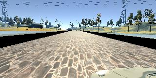
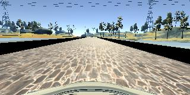
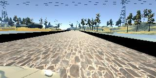
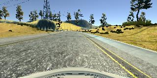
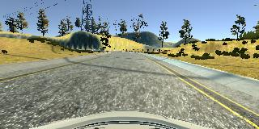
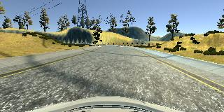

# **Behavioral Cloning** 

The goals / steps of this project are the following:

* [x] Use the simulator to collect data of good driving behavior
* [x] Build, a convolution neural network in Keras that predicts steering angles from images
* [x] Train and validate the model with a training and validation set
* [x] Test that the model successfully drives around track one without leaving the road
* [x] Summarize the results with a written report (this document)


[//]: # (Image References)

[image1]: ./examples/placeholder.png "Model Visualization"
[image2]: ./examples/placeholder.png "Grayscaling"
[image3]: ./examples/placeholder_small.png "Recovery Image"
[image4]: ./examples/placeholder_small.png "Recovery Image"
[image5]: ./examples/placeholder_small.png "Recovery Image"
[image6]: ./examples/placeholder_small.png "Normal Image"
[image7]: ./examples/placeholder_small.png "Flipped Image"

## Rubric Points

Here I will consider the [rubric points](https://review.udacity.com/#!/rubrics/432/view) individually and describe how I addressed each point in my implementation.

---
### Submission Files

#### 1. Submission includes all required files and can be used to run the simulator in autonomous mode

* model.py containing the script to create and train the model
* drive.py for driving the car in autonomous mode
* model.h5 containing a trained convolution neural network 
* writeup.md summarising the results (this document)
* video.mp4 video of autonomous run on track 1 with the trained model

#### 2. Additional files

* model_track2.h5 trained model for the second track
* video_track2.h5 video of autonomous run on track 2 with its trained model

### Code Quality

#### 1. Submission includes functional code

To train a model with the default configuration, simply run

```sh
$ python model.py
```

The internal of the code is modular and can be used more flexibly. I will explain this in the next section.

#### 2. Submission code is usable and readable

To make full use of the code, one can import it in an interactive shell such as IPython or Jupyter notebook, like so

```python
import model as m
```

**Building model**

There are two model construction functions included: `network` and `net_nvidia`. The former is a 3-convolutional later followed by 3-dense layer network, while the latter is an implementation of the model in [Bojarski 2016]. Both functions take no arguments and return keras model of the respective network.

```python
mdl = m.network() # for first model
mdl_nv = m.net_nvidia() # for nvidia end-to-end
```

**Training model**

To train the model, use the `train` function. It returns a Keras history object (the same kind that you get with the `model.fit` function in Keras).

```python
h = m.train(mdl)
```

The default epoch count is 5, and default batch size is 32. Both can be changed with keyword arguments (`epochs` and `batch_size` respectively). Additionally, one can pick the dataset to use for the training and whether to augment it with mirror images with the `train_fname` and `mirror` keyword arguments.

The `train_fname` argument expects a path (as string) of the `driving_log.csv` file and the training images. For instance, `/home/workspace/project/record/driving_log.csv`, or its relative path from `model.py`.

The use case for this keyword argument is when you would like to train the model for a set epoch with track 1 data and then later train further with track 2 data. Naturally, you must record the two in different directories. In addition, track 2 has lane lines, and one might want to try training the model to drive on the left, right, or centre. If the logs are separate, this feature facilitates separate training.

The `mirror` argument also helps with the track 2 lane lines problem. Mirroring left-hand-drive dataset gives right-hand-drive dataset, which might not be what you want. Set `mirror` to `False`, and you can avoid mixing lane lines.

**Retraining model**

To perform more training on a model, use the `m.train` function on a model loaded with `keras.models.load_model`, for example:

```python
from keras.models import load_model

mdl = load_model('model.h5')
hst = m.train(mdl, fname='./record2/driving_log.csv', mirror=False)

```

**Using trained model**

There is a small change to the provided `drive.py`, I made it so that the target speed can be changed from the default 9 [mph]. When used in the original way, there is no difference in behaviour, so this would still work:

```bash
$ python drive.py model.h5
```

To set a new target speed, use the `--speed ` argument, like so:

```bash
$ python drive.py model.h5 --speed 18
```

I tested the submitted model (`model.h5`) at 18 [mph]. The track two model (`model_track2.h5`) would only work at 9 [mph], any faster and the car would drive off one of the many cliffs around the track.

### Model Architecture and Training Strategy

#### 1. Employ appropriate model

My model is adapted from [Bojarski 2016], the NVIDIA end-to-end driving model. I will use the shorthand nvidia model in this writeup.

There are a few difference, or at least added details, from the original nvidia model. They are:

- I used RGB image input, the paper used YUV
- My model has relu activation after each convolutional and dense layers (except the last), the paper did not mention what activation it used
- I included a dropout layer after the final convolutional layer
- I have one output, corresponding to vehicle angle

More completely, the model layers are as follow:

- Input layer (RGB image, (160 x 320 x 3)
- Crop preprocessing (takes 20 px from top, 50 px from bottom)
- Normalisation (x/255 - 0.5)
- Convolution (24 deep, 5x5 filter, (2, 2) strides)
- Relu
- Convolution (36 deep, 5x5 filter, (2, 2) strides)
- Relu
- Convolution (48 deep, 5x5 filter, (2, 2) strides)
- Relu
- Convolution (64 deep, 3x3 filter, (1, 1) strides)
- Relu
- Convolution (64 deep, 3x3 filter, (1, 1) strides)
- Dropout (0.3 probability to *drop*)
- Relu
- Flatten
- Dense (100)
- Relu
- Dense (50)
- Relu
- Dense (10)
- Relu
- Dense (1)

#### 2. Make attempt to reduce overfitting

I use a dropout layer with drop probability 0.3 after the final convolutional layer.

#### 3. Tune model parameters

I use `adam` optimiser.

#### 4. Choose appropriate training data

For submission model (`model.h5`), I use training data from driving only on track 1. More detail on the data gathering strategy in the next section.

For extra track 2 model (`model_track2.h5`), training data from both track 1 and track 2 are used. However, unlike track 1 data, track 2 data was not augmented with their mirror. As there are lane lines in track 2, mirroring the images would make right-hand drive to left-hand drive. 

### Model Architecture and Training Documentation

#### 1. Solution Design Approach

To start, I built a convolutional network similar to the previous traffic sign project: 3 convolutional layers, all with 5x5 filters with depths: 16, 32, and 64. They are each followed by dropout layers (p = 0.25 to *drop*) and `relu`. After that, a flatten, then 3 dense layers of size 1000, 500, and 200, and finally a single output neuron.

This model results in a very large model (200 [MB]). The size itself does not have bearing to its appropriateness, but soon after I set aside time to read [Bojarski 2016] and decided to try the nvidia model from that first. After all, the paper's goal and this project's are very similar.

I had good results with the nvidia model, so it is the final model architecture.

#### 2. Final Model Architecture

The architecture is as follows (reproduced from previous section):

- Input layer (RGB image, (160 x 320 x 3)
- Crop preprocessing (takes 20 px from top, 50 px from bottom)
- Normalisation (x/255 - 0.5)
- Convolution (24 deep, 5x5 filter, (2, 2) strides)
- Relu
- Convolution (36 deep, 5x5 filter, (2, 2) strides)
- Relu
- Convolution (48 deep, 5x5 filter, (2, 2) strides)
- Relu
- Convolution (64 deep, 3x3 filter, (1, 1) strides)
- Relu
- Convolution (64 deep, 3x3 filter, (1, 1) strides)
- Dropout (0.3 probability to *drop*)
- Relu
- Flatten
- Dense (100)
- Relu
- Dense (50)
- Relu
- Dense (10)
- Relu
- Dense (1)

The model construction is encapsulated in the function `net_nvidia` in the submission code (`model.py`).

#### 3. Creation of the Training Set & Training Process

**Data acquisition**

All three cameras, centre, left, and right, were used. Angle offset for side cameras is 0.2, so that, if the vehicle angle is angle_data:

- angle_centre = angle_data
- angle_left = angle_data + 0.2
- angle_right = angle_data - 0.2

The training data for track 1 is also augmented with the mirror of the three cameras, with the signs of the angles flipped. For track 2, no mirroring is done so that the network is only trained to drive on the right-hand lane.

For each track, two laps of normal driving are recorded. After, recovery behaviours were also recorded. These behaviours include centring the vehicle from near edge.

Data from track 1 and 2 are saved in different directories, because their training treatment are different w.r.t mirroring.

**Data treatment**

I wrote the helper functions in `model.py` to facilitate the above.

The `train` function takes a model (e.g., constructed with one of the model constructor functions), and train the model with specified dataset (track 1 or track 2). It also has a switch to mirror the training data or not (keyword arg `mirror`). 

Sample data are gathered by the `get_samples_list` function. This function interprets the `driving_log.csv` file into python lists that are more easily used in the rest of the code. Its output is a 2D list where each row contains three elements: image path, vehicle angle, and mirror flag. Actual image loading is done later by generator functions so that they are loaded to memory a batch at a time.

The image path is translated to the current machine's path here. This was necessary because I had to gather the data and train the model in different computers. Data gathering was done locally as the workspace had too much latency (hard to drive!), but training was done on the workspace to take advantage of the GPU. The vehicle angles are offset depending on the camera (centre, left, right) as has been described in previous section. The mirror flag tells the generator later whether to flip the image. In this way, the flipping operation is done as close as possible to when the data is used.

Training and validation data are prepared by a generator function `datagen`. This function takes a batch of rows from the master list, load the images, flip them when necessary, shuffle the batch, then provide it to keras' training function.

**Training process**

I used `mse` as the loss function for training. I started training with 5 epochs. Then repeat with another 5 or fewer until the validation loss did not reduce any more. For track 1 only training, the first 5 epochs are usually enough. For track 2 training, 10~15 epochs in addition to the 5 epochs on track 1 data are needed.

Here is a triplet of image from a normal (centred) driving: (left, centre, right)

  

And for the recovery behaviour, here is recovering from right to centre, the sequence lasted about 1.5 [s]:







### Simulation

#### 1. Correct navigation

For example of navigation result, see `video.mp4` for track 1 and `video_track2.mp4` for track 2. At this time, I have not discovered a model that converge to work on both track 1 and track 2.

How to use the model with the `drive.py` is described above in section **Using trained model**.

When running on your own machine, please match the versions of these requirements:

- python=3.5
- tensorflow==1.3.0
- keras=2.2

Especially python version. Models saved in python 3.5 would not work on python 3.6.